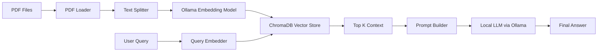
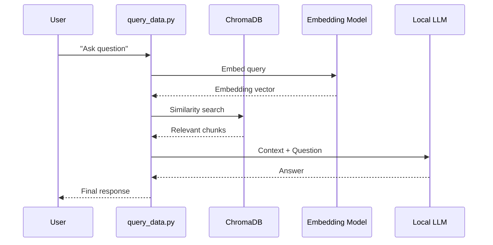

Here is the full **README.md** ready to copy and paste.

---

# 𝗹𝗼𝗰𝗮𝗹-𝗿𝗮𝗴-𝗸𝗻𝗼𝘄𝗹𝗲𝗱𝗴𝗲-𝘀𝗲𝗮𝗿𝗰𝗵

A fully local Retrieval Augmented Generation system that runs offline using Ollama, ChromaDB, and LangChain.
The project indexes your PDFs, embeds them with a local model, and answers questions using a local LLM.

The system is private, simple, and free to run.

---

## Table of Contents

* Overview
* Architecture
* RAG Flow
* Features
* Installation
* Setup
* Indexing Documents
* Querying Data
* Project Structure
* Example Output
* Optional: Open WebUI Integration
* Roadmap
* License

---

## Overview

This project provides a minimal offline RAG pipeline.
You can embed your documents, store vectors locally, and query them without any cloud services.

Key technologies:
• Ollama
• ChromaDB
• LangChain
• Python

---

## Architecture



---

## RAG Flow



---

## Features

• Local embeddings
• Local LLM inference
• Offline vector store
• PDF ingestion and chunking
• Simple CLI tools
• Modular Python design

---

## Installation

Install Python packages:

```bash
pip install -r requirements.txt
```

Install Ollama:

[https://ollama.com](https://ollama.com)

Pull local models:

```bash
ollama pull mxbai-embed-large
ollama pull llama3
```

---

## Setup

### 1. Add documents

Create a folder called `data`:

```
mkdir data
```

Add your PDFs inside this folder.

### 2. Build the vector database

```bash
python populate_database.py
```

This loads PDFs, extracts text, chunks it, creates embeddings and stores them in ChromaDB.

---

## Querying Data

Ask questions using the CLI:

```bash
python query_data.py "Your question here"
```

The script will:

• Embed your question
• Run similarity search
• Build a prompt
• Ask the local LLM
• Return an answer grounded in your documents

---

## Project Structure

```
local-rag/
│
├── app.py                     # Optional API
├── populate_database.py       # Build vector DB
├── query_data.py              # Query interface
├── get_embedding_function.py  # Embedding model
├── test_rag.py                # Tests
├── chroma/                    # Local vector store
├── data/                      # Your PDFs
└── requirements.txt
```

---

## Example

```bash
python query_data.py "What are the rules of Ticket to Ride?"
```

Example response:

```
Based on your documents, Ticket to Ride is a board game where...
```


